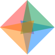
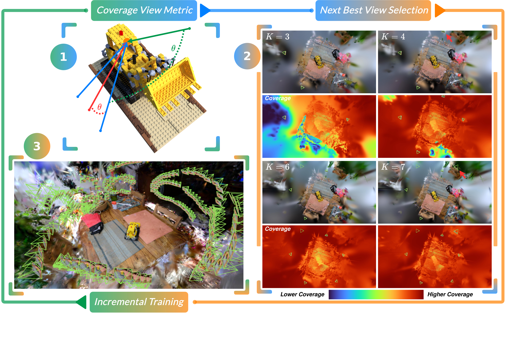

<h1>
  
  NBV-Gym: A Plugin Framework for Next Best View Selection
</h1>

<br>

### [Project Website](https://chengine.github.io/nbv_gym/) &nbsp;|&nbsp; [Paper](https://chengine.github.io/nbv_gym/assets/COVER.pdf)

**[Timothy Chen](https://msl.stanford.edu/people/timchen)\*, [Adam Dai](https://scholar.google.com/citations?user=PVl3j4cAAAAJ&hl=en)\*, [Maximilian Adang](https://msl.stanford.edu/people/maximilianadang), [Grace Gao](https://profiles.stanford.edu/gracegao), [Mac Schwager](https://profiles.stanford.edu/mac-schwager)**

**Stanford University**

🎉 **Accepted to CVPR 2026** 🎉

<sub>\*Equal contribution</sub>

---

**NBV-Gym** is a [Nerfstudio](https://github.com/nerfstudio-project/nerfstudio) plugin that turns *Next Best View (NBV) selection* into a reproducible benchmarking problem. It progressively expands the training set during 3D Gaussian Splatting optimization by querying a pluggable view-selection metric — allowing researchers to easily implement, ablate, and compare their own active view selection strategies under a common training pipeline.

> The repo ships with our published metric **COVER** (*Coverage Optimization for Camera View Selection*, CVPR 2026), but the framework is designed to host **any** view metric. NBV-Gym is the **gym**: bring your own metric, train, and compare against the baselines.

---

## Pipeline



NBV-Gym wraps the standard Nerfstudio training loop with an **active view selection loop**. Every `N` gradient steps, the framework does the following:

1. **Score candidate views** &mdash; the active `view_metric` is queried against the current 3DGS state, returning a scalar score for each unused training camera.
2. **Select the next best view(s)** &mdash; the active `view_selector` (e.g. random, top-K, KD-tree filtered) picks one or more views from the ranked candidates.
3. **Expand the active set** &mdash; chosen views are moved from the candidate pool into the active training set, and incremental optimization continues.

All of this is orchestrated by `ViewSelectionPipeline` (`nbv_gym/pipeline.py`) and `ViewSelectionDataManager` (`nbv_gym/datamanager.py`). As an implementer of a new metric, **you only need to define how to score a view** &mdash; everything else (candidate sampling, scheduling, training, evaluation hooks) is handled for you.

---

## Implementing Your Own View Metric

NBV-Gym uses a factory pattern (`create_view_selector` / `setup_view_metric`) so adding a new metric is just a few lines:

1. **Write a scoring function** in `nbv_gym/util/coverage.py` (or a new module). It receives the current Gaussian model and a batch of candidate cameras and returns per-camera scores.
2. **Register the metric** by adding a branch in `nbv_gym/model.py:setup_view_metric()`.
3. **Run training** with `--pipeline.view-metric <your-metric>`.

Built-in metrics already include `coverage`, `fig`, `view_fig`, `fig_diag`, `view_fig_diag`, `fig_color_field`, and `fisher_rf` &mdash; use them as templates.

---

## Dependencies

| Dependency | Version |
|------------|---------|
| Python | 3.10 |
| Nerfstudio | From source (as of 11/21/2025) |
| PyTorch | 2.5.1+cu124 |
| gsplat | 1.5.3 |
| Pillow | < 11 |
| numpy | < 2.0 |

---

## Installation

### 1. Create a conda environment

```bash
conda create -n nbv_gym python=3.10 -y
conda activate nbv_gym
```

### 2. Install Nerfstudio from source

```bash
git clone https://github.com/nerfstudio-project/nerfstudio.git
cd nerfstudio
pip install -e .
cd ..
```

### 3. Clone and install NBV-Gym

```bash
git clone https://github.com/chengine/nbv_gym.git
cd nbv_gym
pip install -r requirements.txt
pip install -e .
```

`requirements.txt` fixes dependency versions that Nerfstudio installs incorrectly:

- **PyTorch**: Downgraded to 2.5.1+cu124 (Nerfstudio's default ships CUDA 13.0 which requires a very recent NVIDIA driver)
- **gsplat**: Upgraded to 1.5.3 (Nerfstudio pins 1.4.0)
- **Pillow**: Pinned below 11 (11+ breaks nerfstudio's `pil_to_numpy`)
- **numpy**: Pinned below 2.0

> **Note:** If your NVIDIA driver supports a different CUDA version than 12.4, edit `requirements.txt` to use the appropriate PyTorch index URL (see [PyTorch installation](https://pytorch.org/get-started/locally/)).

### 4. Register with Nerfstudio

```bash
ns-install-cli
```

---

## Usage

Run NBV-Gym using the standard Nerfstudio training command:

```bash
ns-train nbv-splat --data <path-to-data> --output-dir <output-directory>
```

### Configuration Options

#### View Selector

Controls how new views are selected during progressive training.

```bash
--pipeline.view-selector <mode>
```

| Mode | Description |
|------|-------------|
| `all` | Use all views from the start (no progressive selection) |
| `random` | Randomly select views to add |
| `basic` | Use view metrics to intelligently select the most informative views |

#### View Metrics

When using `--pipeline.view-selector basic`, specify the metric for scoring candidate views:

```bash
--pipeline.view-metric <metric>
```

| Metric | Description |
|--------|-------------|
| `coverage` | COVER &mdash; coverage-based metric (ours) |
| `fig` | Fisher Information Gain |
| `view_fig` | View-weighted Fisher Information Gain |
| `fig_diag` | Diagonal approximation of FIG |
| `view_fig_diag` | View-weighted diagonal FIG |
| `fig_color_field` | FIG with color field consideration |
| `fisher_rf` | Fisher-RF uncertainty (requires modified rasterizer) |

#### KD-Tree Filtering

Enable spatial filtering to reduce the candidate pool during view selection:

```bash
--pipeline.view-selection-use-kdtree-filter True
--pipeline.view-selection-num-nearest-neighbors 5
```

#### Progressive Training Parameters

```bash
--pipeline.add-every-n-steps 200      # Steps between adding new views
--pipeline.add-num-views 1            # Number of views to add each time
--pipeline.start-num-views 10         # Initial number of views
```

### Example Commands

**Basic training with all views:**
```bash
ns-train nbv-splat --data ./data/scene \
    --output-dir ./outputs \
    --pipeline.view-selector all
```

**Progressive training with coverage-based selection:**
```bash
ns-train nbv-splat --data ./data/scene \
    --output-dir ./outputs \
    --pipeline.view-selector basic \
    --pipeline.view-metric coverage \
    --pipeline.add-every-n-steps 200 \
    --pipeline.add-num-views 1 \
    --pipeline.start-num-views 5
```

**Progressive training with KD-tree filtering:**
```bash
ns-train nbv-splat --data ./data/scene \
    --output-dir ./outputs \
    --pipeline.view-selector basic \
    --pipeline.view-metric fig \
    --pipeline.view-selection-use-kdtree-filter True \
    --pipeline.view-selection-num-nearest-neighbors 10
```

---

## Baselines

### Fisher-RF

Fisher-RF uncertainty is available as a view metric (`--pipeline.view-metric fisher_rf`). This requires installing the modified Gaussian rasterizer:

```bash
# Clone and install the modified rasterizer (use gcc/g++ 11)
git clone --recursive https://github.com/JiangWenPL/modified-diff-gaussian-rasterization-w-depth
cd modified-diff-gaussian-rasterization-w-depth
pip install -e . --no-build-isolation
```

> **Note:** A standalone Fisher-RF model with full training support will be added in a future release.

---

## Citation

If you use NBV-Gym or COVER in your research, please cite:

```bibtex
@inproceedings{chen2026cover,
  author    = {Timothy Chen and Adam Dai and Maximilian Adang and Grace Gao and Mac Schwager},
  title     = {Coverage Optimization for Camera View Selection},
  booktitle = {Proceedings of the IEEE/CVF Conference on Computer Vision and Pattern Recognition (CVPR)},
  year      = {2026}
}
```

---

## License

See [LICENSE](LICENSE) for details.
